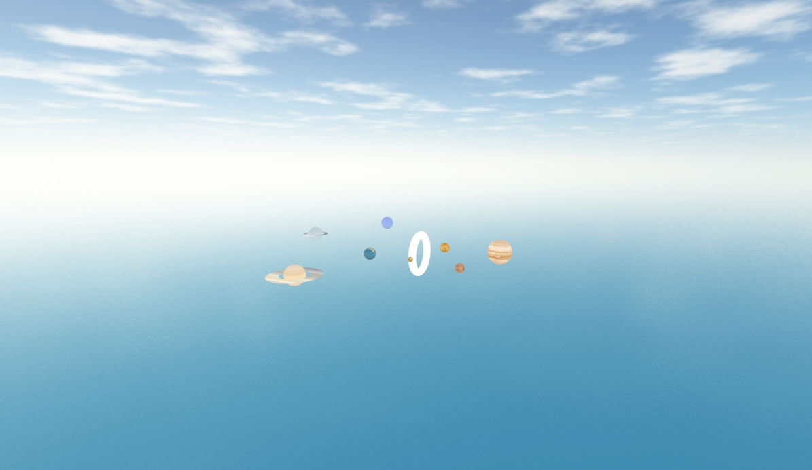

# ORBIT - a celestial playground

ORBIT is a project that aims to recreate the solar system using Three.js, a JavaScript library for 3D graphics. An immersive and visually stunning recreation of the solar system. As you explore, you'll be surrounded by a boundless ocean backdrop, accentuated by ethereal clouds that stretch endlessly. Prepare to embark on a captivating journey through space. It provides an interactive and visually appealing representation of the celestial bodies in our solar system.

---

